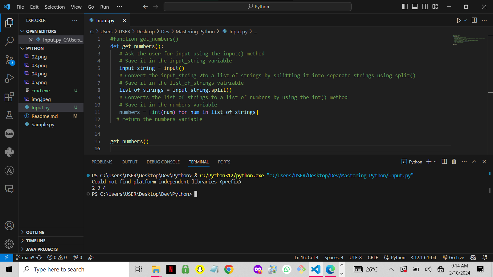

# VARIABLES & DATA TYPES IN PYTHON

## VARIABLE

##### Variable is a reusable cointainer for storing value, a variable behaves as if it were the value it contains.

## DATA TYPES
 There are four different types as listed below with samples. Each data type has its own set of properties, methods, and behaviors that allow programmers to manipulate and process data effectively in their programs.

>>INTEGER
>
This basically represent whole numbers no fraction parts.

age= 21

players= 22

coaches= 2

print(f"The average age of players in the match is {age} years old")

print(f"There are {players} players on the pitch")

print(f"There has been just {coaches} coaches in football")

>>FLOAT
>
Float is used to represent real numbers and is written with a decimal point.

exg = 0.96

distance = 3.6

price = 78.5

print(f"The expected goal for Ronaldo in a match is {exg} isn't that insane")

print(f"During his last match he ran an average of {distance}km off the ball")

print(f"He's now worth a whooping sum of $ {price} million")

>>STRING
>
Strings are sequences of character data. 

name = "Ronaldo"

club = "Al nassr"

nickname = "Cr7"

print(f"The best footballer outchea is {name}")

print(f"The current team he's with is {club}")

print(f"He got another name as {nickname}")

>>BOOLEAN
>
Booleans represent one of two values: True or False.

manU = True

Madrid = True

Barca = False

print(f"Ronaldo play for Manchester?: {manU}")

print(f"Ronaldo play for Madrid?: {Madrid}")

print(f"Ronaldo play for Barca?: {Barca}")

<<<<<<< HEAD

>+  MORE ON VARIABLES

**Combination of 3 functions**

   #Function to get numbers from the user
def get_numbers():
    input_strings = input("Type here: ")
    list_of_strings = input_strings.split()
    list_of_numbers = [float(num) for num in list_of_strings]
    return list_of_numbers

  list_of_numbers = get_numbers()

   #Function to calculate the sum of a list of numbers
def calculate_sum(any_list_of_number):
    total = sum(any_list_of_number)
    return total

total = calculate_sum(list_of_numbers)

  #Function to display the sum to the user
def display_result(numbers, result):
    print('The sum of {} is {}'.format(numbers, result))

def main():
list_of_numbers = get_numbers()
total = calculate_sum(list_of_numbers)
  
  

>+ MANIPULATING LIST

**Define a list of numbers**
numbers = [1, 2, 3, 4, 5]
           
**Access and print individual elements**
print(numbers[1])
print(numbers[2])
print(numbers[3])
print(numbers[-1])
print(numbers[-2])
print(numbers[-3])
 
**Modify an element**

numbers[-1]=3
print(numbers)

**Add an element to the end**

numbers.append(10)
print(numbers)

**remove an element from the list**

numbers.pop()
print (numbers)
numbers.remove(1)
print(numbers)

**Get the length of the list**

print("Print the length of the list")
print(len(numbers))

**Iterate through the list**

print("iterate through the list")
list_of_strings = ["1","2","3","4","5"]
list_of_numbers = [float(x) for x in list_of_strings]
print(list_of_numbers)

**Executing string using split**

string_1 = "I am a boy"                                  #this is a string
string_2 = "2 3 4 5 6"                                   #this isa string
list_1 = ["I" "am" "a" "boy"]                            #This is a list of strings
list_2 = ["2" "3" "4" "5" "6"]                           #This is a list of strings

print(string_1)
print(string_1.split())

print(string_2)
print(string_2.split())

=======
>>>>>>> 5bde3625819a8532f0100bc2863a08f5a94c5c6d
