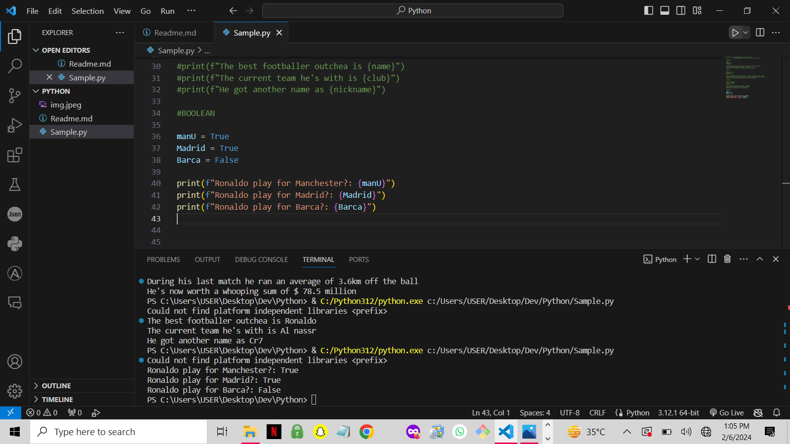

# VARIABLES & DATA TYPES IN PYTHON

## VARIABLE

##### Variable is a reusable cointainer for storing value, a variable behaves as if it were the value it contains.

## DATA TYPES
##### There are four different types as listed below with samples. Each data type has its own set of properties, methods, and behaviors that allow programmers to manipulate and process data effectively in their programs.

>####INTEGER
This basically represent whole numbers no fraction parts.

age= 21
players= 22
coaches= 2

print(f"The average age of players in the match is {age} years old")
print(f"There are {players} players on the pitch")
print(f"There has been just {coaches} coaches in football")

>####FLOAT
Float is used to represent real numbers and is written with a decimal point.

exg = 0.96
distance = 3.6
price = 78.5

print(f"The expected goal for Ronaldo in a match is {exg} isn't that insane")
print(f"During his last match he ran an average of {distance}km off the ball")
print(f"He's now worth a whooping sum of $ {price} million")

>####STRING
Strings are sequences of character data. 

name = "Ronaldo"
club = "Al nassr"
nickname = "Cr7"

print(f"The best footballer outchea is {name}")
print(f"The current team he's with is {club}")
print(f"He got another name as {nickname}")

>####BOOLEAN
Booleans represent one of two values: True or False.

manU = True
Madrid = True
Barca = False

print(f"Ronaldo play for Manchester?: {manU}")
print(f"Ronaldo play for Madrid?: {Madrid}")
print(f"Ronaldo play for Barca?: {Barca}")

